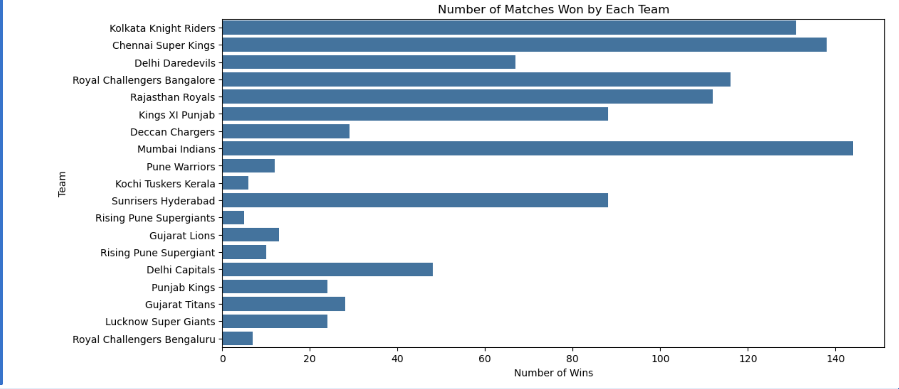
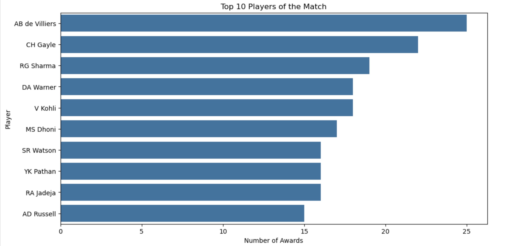
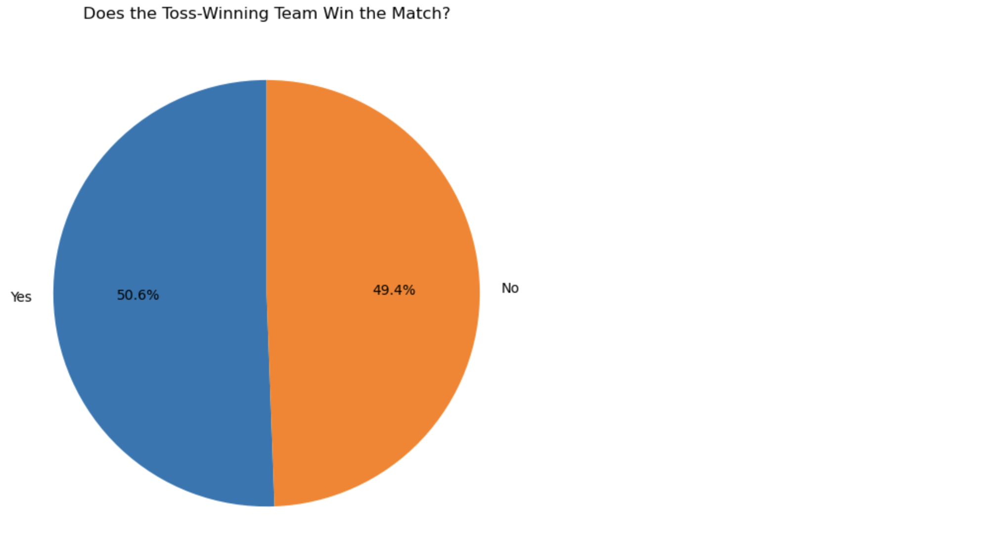
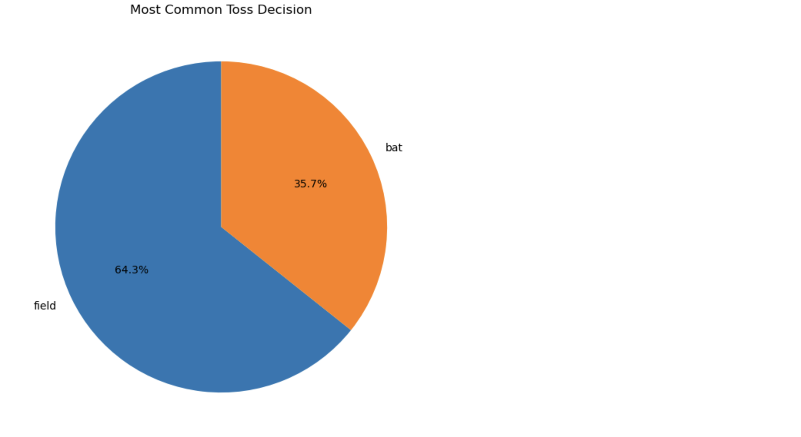

# End-to-End Data Analysis of the Indian Premier League (2008-2020) 🏏

## Project Overview

This repository contains my first comprehensive data analysis project, focusing on the Indian Premier League (IPL) from 2008 to 2020. The goal of this project was to practice and demonstrate the complete data analysis workflow: from setting up a Python environment and loading data, to performing exploratory data analysis, generating insights, and creating meaningful visualizations. The analysis delves into team performance, individual player achievements, and strategic match factors like the coin toss.

---

## Dataset

The analysis is based on the "IPL Complete Dataset 2008-2020," a popular and well-structured dataset sourced from Kaggle. It contains two primary files, but this analysis focuses exclusively on `matches.csv`, which provides match-level information.

* **Source:** [Kaggle IPL Dataset](https://www.kaggle.com/datasets/patrickb1912/ipl-complete-dataset-20082020)
* **File Used:** `matches.csv`

---

## Tools and Libraries

* **Programming Language:** Python
* **Core Libraries:**
    * **Pandas:** Used for data loading, cleaning, and manipulation. The primary tool for handling the data in a structured DataFrame.
    * **Matplotlib & Seaborn:** Used for creating a wide range of static, animated, and interactive visualizations to present the findings in a clear and compelling manner.
* **Development Environment:** Jupyter Notebook, via the Anaconda Distribution.

---

## Analysis Process & Key Insights

The analysis was structured around answering four key business questions to uncover trends within the IPL.

### **1. Who is the most dominant team in IPL history?**

* **Methodology:** To determine team dominance, I analyzed the `winner` column of the dataset. I used the `.value_counts()` function in Pandas to aggregate the total number of match wins for each team. The results were then visualized using a horizontal bar chart for easy comparison.
* **Insight:** The analysis conclusively shows that the **Mumbai Indians** are the most successful team, having secured the highest number of victories between 2008 and 2020.

### **2. Which players have the most significant impact on match outcomes?**

* **Methodology:** A player's impact was measured by the number of "Player of the Match" awards won. I isolated the `player_of_match` column and again used `.value_counts()` to count the awards for each player. I focused on the top 10 players and visualized the data in a bar chart.
* **Insight:** **AB de Villiers** stands out as the most frequent recipient of the "Player of the Match" award, indicating his consistent, game-changing performances over the years.

### **3. How much of an advantage does winning the toss provide?**

* **Methodology:** This question required comparing the `toss_winner` and `winner` columns. I created a boolean series to identify matches where the toss winner was also the match winner. The resulting `True`/`False` values were counted and visualized with a pie chart to show the proportion.
* **Insight:** Winning the toss provides only a **marginal advantage**. The toss-winning team goes on to win the match approximately 52% of the time. This suggests that the outcome of the toss is not a strong predictor of the match result.

### **4. What is the prevailing strategic decision for captains at the toss?**

* **Methodology:** I analyzed the distribution of choices in the `toss_decision` column ('field' or 'bat'). A simple value count and a pie chart were used to illustrate the preferred strategy.
* **Insight:** There is a strong and clear strategic trend in the IPL: captains overwhelmingly **choose to field first** after winning the toss, a decision made over 64% of the time. This suggests a league-wide belief in the advantage of chasing a target.

---

## Conclusion

This project successfully demonstrates the power of data analysis in extracting actionable insights from a dataset. The findings confirm the historical dominance of the Mumbai Indians, highlight the individual brilliance of players like AB de Villiers, and reveal key strategic trends regarding the toss. As a foundational project, this has solidified my skills in Python, Pandas, and data visualization.

For a detailed, step-by-step walkthrough of the code and the analysis process, please refer to the Jupyter Notebook file: **`IPL-Analysis.ipynb`**.
